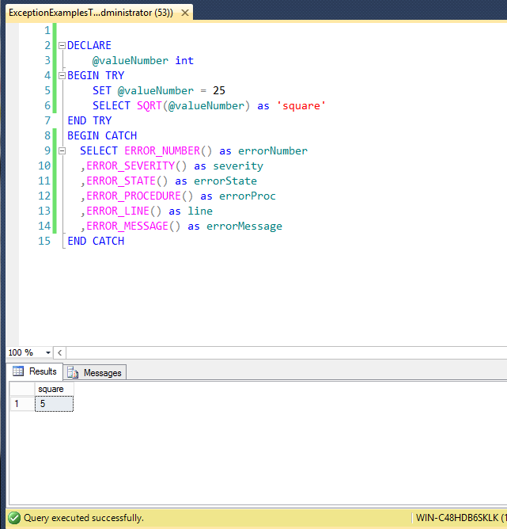
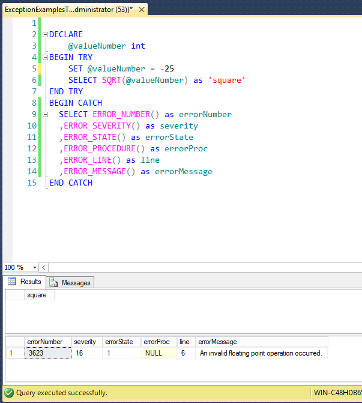
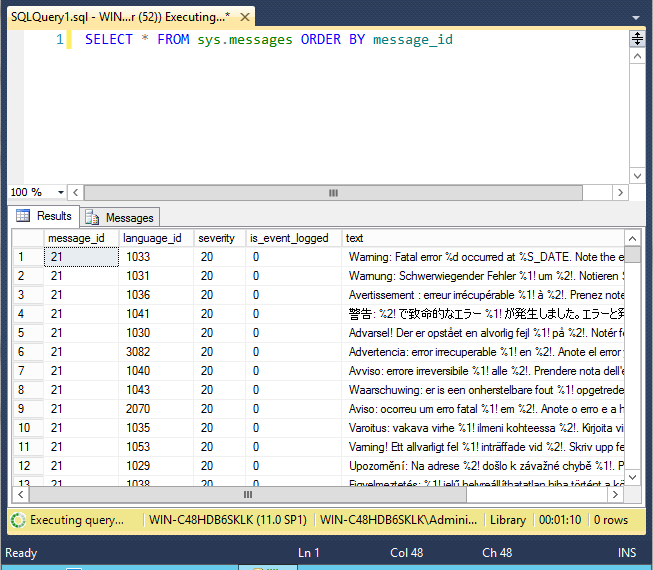

# Utilizando el bloque try/catch en SQL Server para manejar errores

Desde la versión 2005 de Sql Server se incorpora el bloque <b>try/catch</b> para el manejo de errores en el código T-SQL, esta característica similar a la que tienen los lenguajes .NET consiste de dos partes:

<pre>
BEGIN TRY
--Sentencias T-SQL de funcionalidad
END TRY
</pre>

y el bloque CATCH

<pre>
BEGIN CATCH
--Sentencias T-SQL para el manejo de error
END CATCH
</pre>

Cuando se genera un error dentro del bloque <b>TRY</b>, inmediatamente el flujo del programa continua en el bloque <b>CATCH</b> donde el error se procesa de diferentes maneras, sino se genera un error el flujo se salta el bloque <b>CATCH</b> y continua hasta terminar el programa.

Dentro del bloque <b>CATCH</b> puedes utilizar las siguientes funciones del sistema para obtener información del error.
<ul>
<li><b>ERROR_LINE()</b> - El número de línea que causo el error o donde se ejecutó la orden <b>RAISERROR</b>.</li>
<li><b>ERROR_MESSAGE()</b>  - Un texto resumen que indica la naturaleza de error.</li>
<li><b>ERROR_SEVERITY()</b> - Regresa la severidad del error.</li>
<li><b>ERROR_STATE()</b> - Regresa un valor entero que regresa <b>NULL</b> si se ejecutó afuera de un bloque <b>CATCH</b>.</li>
<li><b>ERROR_NUMBER()</b> - Regresa el número de error que causo el error. Esta función regresa el número de error cuando se ejecuta adentro de un bloque <b>CATCH</b>, sino se ejecuta dentro un bloque <b>CATCH</b> regresa <b>NULL</b>.</li>
<li><b>ERROR_PROCEDURE()</b> - regresa el nombre del store procedure o trigger donde ocurrió el error.</li>
<li><b>ERROR_PROCEDURE()</b> - Regresa <b>NULL</b> si el error no ocurre dentro de un <b>STORE PROCEDURE</b>, si se ejecuta dentro de un <b>STORE PROCEDURE</b> o <b>TRIGGER</b> regresa entonces el nombre del <b>STORE PROCEDURE</b> o <b>TRIGGER</b>.</li>
</ul>

Una de las recomendaciones para la utilización del bloque <b>TRY/CATCH</b> es poner una sentencia <b>ROLLBACK TRANSACTION</b> en el bloque <b>CATCH</b> para que en caso de transacciones parciales se conserve la integridad de la información.

 
Cuando se ejecuta este código con el número 25 positivo el programa se ejecuta correctamente y no generará una excepción :

 
<b>Fig 1</b> Ejecutándose con un número positivo no genera excepción.
 
    

    
    
 
 
En cambio si se ejecuta con un entero negativo se lanzará una excepción que el bloque <b>CATCH</b> procesará correctamente.

 
<b>Fig 2</b> Ejecutándose con un numero negativo genera excepción.
 
    

    
    

     
 <h2>Consultando el catalogo sys.messages</h2>
 

 Se puede consultar el catalogo sys.messages para ver la lista completa de números de error y sus correspondientes mensajes con la siguiente sentencia:
 

 <pre>
SELECT
* FROM sys.messages
ORDER BY message_id
</pre>

<b>Fig 3</b> Consultando el catalogo sys.messages para ver la lista completa de errores y mensajes.

